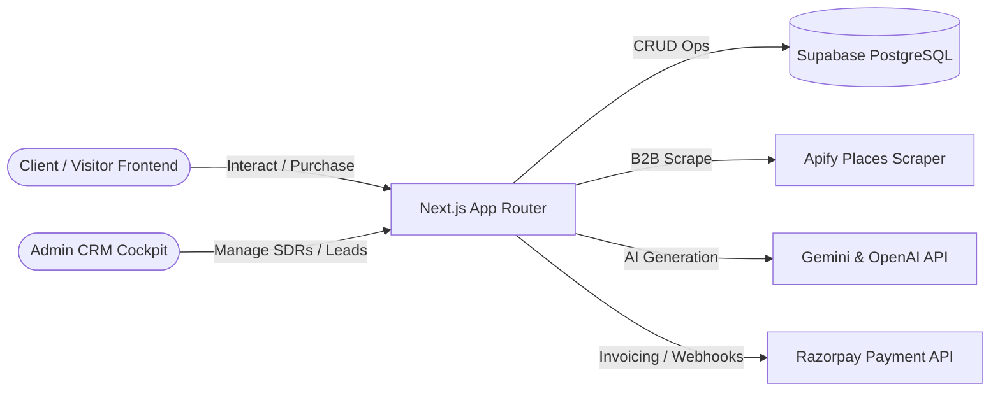

# Grow-X Core Codebase: Architecture & File Tree Report

This report provides a detailed breakdown of the **grow-x** application architecture, complete directory structure, database models, security authentication flows, and automated business workflows.

---

## 1. Team & Objective

* **Who We Are**: 
  * **Lead Developer (USER)**: The architect directing design, user flows, database structures, and feature implementation.
  * **Antigravity (MODEL)**: An advanced agentic AI coding assistant built by Google DeepMind, assisting with refactoring, bug fixes, and system modeling.
* **What We Are Doing**: We are performing a structural audit of the `grow-x` codebase. **No code has been modified in this run**. This document maps the application structure for onboarding and configuration management.

---

## 2. Directory Index & File Tree (`grow-x`)

Below is the directory mapping of the primary Next.js codebase situated at `c:\growxlabs\grow-x\`:

```
c:\growxlabs\grow-x\
├── app/                       # Next.js App Router Routes & Page Layouts
│   ├── (marketing)/           # Marketing pages (Home, Pricing, Careers, Blog, Wish Willow)
│   ├── (restaurant)/          # Restaurant demo vertical pages
│   ├── (hotel)/               # Hotel reservation demo pages
│   ├── (realestate)/          # Real estate listing demo pages
│   ├── admin/                 # Central Admin CRM Cockpit & Command Center
│   ├── api/                   # Serverless endpoints (59 endpoints)
│   │   ├── crm/               # CRM leads and SDR operations
│   │   ├── leads/             # Lead scraping, search, & processing
│   │   ├── invoices/          # Billing, GST, & Razorpay integrations
│   │   ├── outreach/          # AI email B2B marketing planners
│   │   └── auth/              # Client and admin credentials routing
│   ├── auth/                  # NextAuth registration & login entry pages
│   ├── checkout/              # Client checkout forms
│   ├── client/                # Client dashboard & portal
│   ├── client-agreement/      # Digital agreement view & client e-signing
│   ├── courses/               # Edutech courses hub
│   ├── dashboard/             # General telemetry graphs
│   ├── learn/                 # LMS modules and playbooks
│   ├── project/               # Active project onboarding dashboards
│   ├── globals.css            # Main CSS stylesheet (Tailwind CSS configuration)
│   ├── layout.tsx             # Main HTML entry shell
│   └── page.tsx               # Root marketing homepage
│
├── components/                # Modular React UI Components
│   ├── admin/                 # Admin widgets & Command Center chat components
│   ├── marketing/             # Landing cards, headers, footers, & hero blocks
│   ├── onboarding/            # Onboarding wizard sliders
│   ├── client/                # Client dashboard cards & lists
│   ├── demos/                 # Interactive demo sections
│   ├── earth/                 # Three.js 3D earth model components
│   └── ui/                    # Base Design Kit (Buttons, Dialogs, Cards)
│
├── hooks/                     # Custom React hooks (useAuth, useCRM, etc.)
│
├── lib/                       # Utility configurations & helpers
│   ├── actions/               # Next.js Server Actions
│   ├── api/                   # Third-party service API endpoints
│   ├── supabase/              # Supabase clients & RPC wrappers
│   ├── auth.ts                # NextAuth setup
│   ├── design-system.ts       # Central theme colors and gradients
│   ├── utils.ts               # CSS class merger helpers
│   └── *.ts                   # Property, Hotel, & Restaurant static datasets
│
├── services/                  # Core Business Services
│   ├── scraping.service.ts    # Google Places lead scraping logic
│   ├── outreach.service.ts    # B2B cold email generator logic
│   ├── invoice.service.ts     # Razorpay & PDF builder helpers
│   ├── ai-crm.ts              # CRM lead intelligence coordinator
│   └── *.service.ts           # Enterprise services (HRMS, Finance, PM)
│
├── types/                     # TypeScript structural interfaces
│
├── public/                    # Static assets (images, icons, vectors)
│
├── tests/                     # Automated testing spec files
│
└── supabase_*.sql             # PostgreSQL schema DDLs (CRM, Billing, Auth, HRMS)
```

---

## 3. System Architecture

The core application runs on Next.js v16 (App Router) combined with a Supabase PostgreSQL database backend. 



### Core Tech Stack
* **Framework**: Next.js v16.2.4 (App Router) & React v19.2.4
* **Database & Auth**: Supabase PostgreSQL database + NextAuth.js (`next-auth`)
* **Styling**: TailwindCSS v4 with custom HSL dark mode palettes
* **Third Party Integrations**: Razorpay (Billing), Resend (SMTP), Apify (Scraping), Apollo (B2B Lead enrichment)

---

## 4. Supabase Database Schema Specifications

The PostgreSQL database (Supabase) is modeled around several business verticals.

### A. Leads & CRM Schema
* **`leads` Table**: Holds prospects scraped from Google Maps.
  * *Key Columns*: `id`, `business_name`, `email`, `phone`, `website_url`, `google_rating`, `lead_score`, `status`, `outreach_generated`, `outreach_sent`.
* **`crm_leads` Table**: Main active CRM leads pipeline.
  * *Key Columns*: `id`, `business_name`, `contact_name`, `email`, `phone`, `city`, `status` (`'new'`, `'contacted'`, `'negotiation'`), `priority` (`'low'`, `'medium'`, `'high'`), `deal_value`, `assigned_to` (UUID referencing `team_members`).
* **`lead_activities` Table**: Audit logs of contact attempts.
  * *Key Columns*: `id`, `lead_id` (references `crm_leads`), `team_member_id`, `activity_type` (`'call'`, `'email'`), `notes`, `outcome`.

### B. Access Control & HR
* **`users` Table**: Accounts for clients.
  * *Key Columns*: `id`, `name`, `email`, `role` (enum: `'CLIENT'`, `'ADMIN'`, `'CO_ADMIN'`).
* **`team_members` Table**: Accounts for SDRs and internal agents.
  * *Key Columns*: `id`, `name`, `email`, `role` (`'crm_agent'`), `is_active`, `accepted_terms`, `allowed_paths` (text array of routes).
* **`career_applications` Table**: Inbound hiring applicants.
  * *Key Columns*: `id`, `name`, `email`, `role`, `status` (`'new'`, `'reviewed'`, `'shortlisted'`), `tech_stack`, `resume_url`, `notes`.

### C. Financials & Agreements
* **`agreements` Table**: B2B agreements for custom development.
  * *Key Columns*: `id`, `client_id` (references `users`), `service_type`, `total_amount`, `advance_amount`, `balance_amount`, `status` (`'draft'`, `'awaiting_client_signature'`, `'fully_signed'`).
* **`invoices` Table**: Client bills.
  * *Key Columns*: `id`, `client_id`, `agreement_id`, `amount`, `status` (`'pending'`, `'paid'`), `razorpay_order_id`, `due_date`.

---

## 5. Security & Permission Workflows

### SDR Path Authorization Model
The admin cockpit (`/admin`) enforces role-based path validation inside `app/admin/layout.tsx`:

* **`ADMIN` / `CO_ADMIN`**: Full clearance to configure API keys, command center pipelines, and team rosters.
* **`crm_agent` (SDR)**: Access is constrained using the `allowed_paths` field from the database.
  * *Interception Logic*: If an SDR tries to navigate to `/admin/team` or `/admin/command-center`, the layout intercepts the request, calls the serverless path `/api/team/log-alert` to log the intrusion, and redirects the SDR back to `/admin/crm`.

### Core Automated Workflows
1. **Google Maps Lead Scraping**:
   * SDR sets search parameters (e.g. "hotels in Mumbai") -> Apify Crawler task is launched.
   * `ScrapingService` processes results and scores digital footprints: No website (`+4`), reviews <50 (`+2`), rating <4.2 (`+1`).
   * Results with score $\ge$ 6 are qualified and saved into the database, while listings with existing modern websites are skipped.
2. **Agreement & Invoice Settlement**:
   * Agreement drafted -> Client signs via `/client-agreement` -> Admin countersigns -> Status set to `fully_signed`.
   * System generates Invoice with a Razorpay Order ID.
   * Payment webhook sets status to `paid`, triggering client portal activation (`/client`) and initializing progress metrics in the `projects` table.
