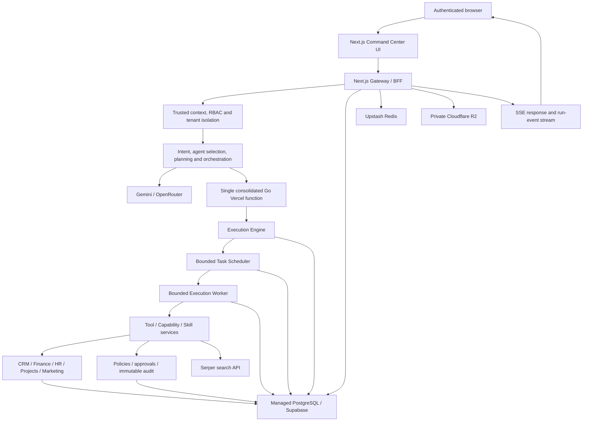
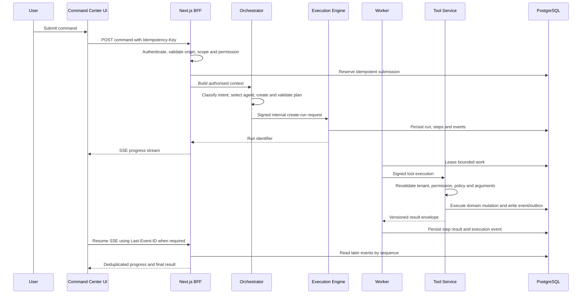

# GXL Command Center Architecture and Internal File Tree

**Report date:** 30 July 2026  
**Source of truth:** Current repository implementation and `vercel.json`  
**System status:** Implemented; live production acceptance remains pending

## 1. Executive overview

GXL Command Center is an AI-assisted operations platform built as a layered
Next.js application with bounded Go service handlers and PostgreSQL-backed
durable state.

The browser communicates only with authenticated Next.js Gateway/BFF routes.
The BFF establishes the trusted user, organisation, workspace, permissions,
request ID, and trace ID before invoking orchestration or internal services.
Private Go handlers and internal Next.js execution routes require
service-to-service authentication.

The current Vercel configuration exposes exactly one consolidated Go function:

```text
api/private/gateway/index.go
```

All private Go route rewrites enter that function. It dispatches internally to
the execution, worker, scheduler, tool, registry, governance, and business
domain packages. This keeps Vercel within its Go-function limit while
preserving service boundaries in source code.

## 2. Current deployment architecture



### Deployment targets

| Component | Current target | Browser-accessible |
| --- | --- | --- |
| Next.js UI, BFF, orchestrator and compatibility tools | Vercel | Yes, through authenticated routes |
| Consolidated private Go gateway | Vercel Go Function | No direct browser use |
| Execution Engine package | Dispatched inside consolidated Go function | No |
| Task Scheduler package | Bounded request through consolidated Go function | No |
| Execution Worker package | Bounded request through consolidated Go function | No |
| Tool, capability, skill and domain packages | Dispatched inside consolidated Go function | No |
| PostgreSQL | Supabase or managed PostgreSQL | No |
| Redis | Upstash managed Redis | No |
| Artifact storage | Private Cloudflare R2 | Signed access only |
| Model providers | Gemini and/or OpenRouter | Server-side only |
| Search provider | Serper | Server-side only |

The `services/*/Dockerfile` files remain available for standalone container
deployment. They are not invoked by the root Next.js build and do not start
workers inside the browser or Next.js runtime.

## 3. Browser-to-execution request flow



### Failure behavior

- Duplicate submissions use a database-backed idempotency reservation.
- Rate limits and Cron leases use Upstash Redis in production.
- Model and internal HTTP calls use bounded timeouts, retries, jitter, and
  circuit-breaker behavior.
- Execution events are durable in PostgreSQL and SSE can resume using
  `Last-Event-ID`.
- Internal service failure returns a safe error envelope containing a request
  ID and retryability, without exposing credentials or private URLs.
- Workers and schedulers process bounded batches and return; they do not start
  infinite polling loops inside Vercel.

## 4. Logical layers and responsibilities

### Presentation layer

Located in `app/admin/command-center` and
`components/admin/command-center`.

- Command workspace and conversation thread
- Agent presence and context flyout
- Mention-aware command composer
- Run progress and SSE consumption
- Governance policy, approval, and audit screens
- Accessible dialog focus and reusable UI primitives

### Next.js Gateway/BFF layer

Located in `app/api/admin/command-center`.

- Session authentication
- Browser-origin validation
- Organisation and workspace isolation
- Backend permission enforcement
- Input validation and bounded payloads
- Submission idempotency
- Rate limiting
- SSE streaming
- Safe error translation
- Signed internal service requests

Browser code must not call Go services, PostgreSQL, Redis, R2, model providers,
or search providers directly.

### Context and security layer

Located in `lib/command-center/context`, `security`, and `validation`.

- Builds trusted command context from the authenticated session
- Filters attachments, conversation history, and authorised resources
- Prevents tenant overrides from untrusted request data
- Validates browser origin and internal worker payloads
- Propagates request and trace identifiers

### Intelligence and orchestration layer

Located in `agents`, `intent`, `prompts`, `routing`, `planning`, and
`orchestration`.

- Intent classification
- Agent and skill selection
- Prompt construction
- Model routing and provider policy
- Plan generation, normalization, validation, and policy enforcement
- Streaming orchestration and compatibility fallback

### Execution layer

Located in `lib/command-center/execution`, `services/execution-engine`,
`services/task-scheduler`, and `services/execution-worker`.

- Creates durable runs and steps
- Resolves dependencies
- Queues ready work
- Leases bounded tasks
- Recovers expired leases
- Persists attempts, events, cancellations, and results
- Signs and validates service-to-service JWTs

The Execution Engine contains no business-domain logic. The Worker does not
query domain tables directly.

### Tool and business-service layer

Located in `lib/command-center/tools` and the Go service directories.

- Versioned tool definitions and Zod contracts
- Capability and skill registries
- Tool scope, deadline, idempotency, and approval checks
- Domain adapters for CRM, Finance, HR, Projects, and Marketing
- Compatibility adapters for existing application tools
- Real server-side web search through Serper

### Governance layer

Located in `lib/command-center/governance` and
`services/governance-service`.

- Versioned policies
- Policy decisions
- Approval requests, decisions, revocation, and expiry
- Immutable hash-linked audit events
- Audit transactional outbox
- Retention policies, security counters, and Cron locks

### Persistence and platform-foundation layer

- PostgreSQL is the authoritative record store.
- Execution state lives in the `command_execution` schema.
- Tool/service registry and domain events live in `command_services`.
- Policies, approvals, audit, retention, and locks live in
  `command_governance`.
- Conversations, messages, memory, artifacts, notifications, and platform
  events are persisted through the Phase 6/8 tables and functions.
- Cloudflare R2 stores private artifact bytes; PostgreSQL stores metadata.
- Upstash Redis provides distributed rate limiting and Cron leases, not domain
  truth.

## 5. Security architecture

| Boundary | Control |
| --- | --- |
| Browser → Next.js | Session authentication, origin validation, CSRF-sensitive mutation checks |
| User → tenant data | Trusted organisation/workspace context and backend permission checks |
| Next.js → Go/internal route | Short-lived signed service JWT |
| Worker → tool/model route | Issuer, audience, environment, request, and schema validation |
| Artifact download | Short-lived R2 signed URL, maximum 15 minutes |
| Cron invocation | `CRON_SECRET`, browser rejection, distributed lease, deadline |
| Logs | Structured JSON, recursive secret/prompt redaction, request/trace IDs |
| Browser response | Safe error taxonomy; no stack, secret, SQL, or internal URL exposure |
| Headers | CSP, HSTS, content-type, frame, referrer, and permissions policies |
| Mutations | PostgreSQL transaction, audit event, and transactional outbox where required |

Private values must never use a `NEXT_PUBLIC_*` prefix. This includes database,
R2, Redis, Cron, service JWT, model, search, and internal service credentials.

## 6. Data and migration architecture

Apply Command Center migrations in order:

1. `0003_phase3_execution.sql`
2. `0004_phase4_services.sql`
3. `0005_phase5_governance.sql`
4. `0006_phase6_memory_artifacts_events_notifications.sql`
5. `0007_phase8_production_hardening.sql`

The recent Phase 8 SQL error occurred because migration `0006` had not created
`artifact_idempotency_records`. Migration `0007` must not be applied before
`0006`.

### Migration ownership

| Migration | Main ownership |
| --- | --- |
| `0003` | Runs, steps, dependencies, attempts, queue, and execution events |
| `0004` | Tools, capabilities, skills, execution records, idempotency, and domain events |
| `0005` | Policies, approvals, immutable audit, retention, rate limits, and Cron locks |
| `0006` | Memory, artifacts, platform events, notifications, and processing status |
| `0007` | Production indexes, stronger tenant scope, submission idempotency, retry/outbox functions, and bounded jobs |

## 7. Scheduled operations

The current repository defines eight Command Center Cron routes:

| Route | Responsibility |
| --- | --- |
| `expire-approvals` | Expire stale governance approvals |
| `process-audit-outbox` | Dispatch bounded audit-outbox records |
| `process-events` | Process bounded platform-event records |
| `process-notifications` | Process bounded notification records |
| `compact-memory` | Compact eligible memory records |
| `expire-memory` | Expire retained memory records |
| `clean-artifacts` | Delete eligible artifact bytes and metadata safely |
| `recover-execution` | Recover expired execution leases and schedule ready work |

All schedules in `vercel.json` run no more frequently than daily and are
compatible with the Vercel Hobby scheduling restriction.

## 8. Internal file tree

The following tree is intentionally grouped by responsibility. Generated build
output, dependencies, and unrelated product modules are excluded.

```text
grow-x/
├── app/
│   ├── admin/command-center/
│   │   ├── page.tsx
│   │   ├── InteractiveWorkspace.tsx
│   │   └── governance/
│   │       ├── layout.tsx
│   │       ├── page.tsx
│   │       ├── approvals/
│   │       │   ├── page.tsx
│   │       │   └── approval-inbox.tsx
│   │       ├── audit/
│   │       │   ├── page.tsx
│   │       │   └── audit-viewer.tsx
│   │       └── policies/
│   │           ├── page.tsx
│   │           └── policy-console.tsx
│   └── api/
│       ├── admin/command-center/
│       │   ├── route.ts
│       │   ├── artifacts/
│       │   │   ├── route.ts
│       │   │   └── signed-url/route.ts
│       │   ├── governance/[...path]/route.ts
│       │   ├── memory/route.ts
│       │   ├── notifications/route.ts
│       │   └── runs/[runId]/
│       │       ├── cancel/route.ts
│       │       └── events/route.ts
│       ├── internal/
│       │   ├── health/readiness/route.ts
│       │   └── v1/
│       │       ├── model-executions/route.ts
│       │       └── tool-executions/route.ts
│       └── cron/command-center/
│           ├── clean-artifacts/route.ts
│           ├── compact-memory/route.ts
│           ├── expire-approvals/route.ts
│           ├── expire-memory/route.ts
│           ├── process-audit-outbox/route.ts
│           ├── process-events/route.ts
│           ├── process-notifications/route.ts
│           └── recover-execution/route.ts
├── components/admin/command-center/
│   ├── CommandCenterWorkspace.tsx
│   ├── CommandComposer.tsx
│   ├── CommandSidebar.tsx
│   ├── MessageThread.tsx
│   ├── AgentPresence.tsx
│   ├── ContextFlyout.tsx
│   ├── MentionMenu.tsx
│   ├── command-center.types.ts
│   ├── composer-logic.ts
│   ├── composer-logic.test.ts
│   ├── sse.ts
│   ├── sse.test.ts
│   ├── useDialogFocus.ts
│   └── primitives/
│       ├── AppShell.tsx
│       ├── Badge.tsx
│       ├── Header.tsx
│       ├── Status.tsx
│       └── Workspace.tsx
├── lib/command-center/
│   ├── agents/
│   │   ├── agent.types.ts
│   │   ├── agent-registry.ts
│   │   └── agent-selection.ts
│   ├── artifacts/
│   │   ├── artifact.types.ts
│   │   ├── artifact-service.ts
│   │   ├── r2-storage.ts
│   │   ├── safety-validator.ts
│   │   ├── formula-sanitizer.ts
│   │   ├── artifact-safety.test.ts
│   │   └── generators/
│   │       ├── csv.generator.ts
│   │       ├── docx.generator.ts
│   │       ├── markdown.generator.ts
│   │       ├── pdf.generator.ts
│   │       ├── pptx.generator.ts
│   │       └── xlsx.generator.ts
│   ├── context/
│   │   ├── context.types.ts
│   │   ├── command-center-context.ts
│   │   ├── context-builder.ts
│   │   ├── authorised-context-filter.ts
│   │   ├── attachment-context.ts
│   │   └── conversation-context.ts
│   ├── conversations/conversation.repository.ts
│   ├── messages/message.repository.ts
│   ├── intent/
│   │   ├── intent.types.ts
│   │   ├── intent.schemas.ts
│   │   ├── intent-rules.ts
│   │   ├── intent-classifier.ts
│   │   └── intent.service.ts
│   ├── models/
│   │   ├── provider.types.ts
│   │   ├── model-policy.ts
│   │   ├── gemini.provider.ts
│   │   └── openrouter.provider.ts
│   ├── prompts/
│   │   ├── prompt.types.ts
│   │   ├── prompt-registry.ts
│   │   └── prompt-builder.ts
│   ├── routing/
│   │   ├── routing.types.ts
│   │   ├── capability-router.ts
│   │   └── model-router.ts
│   ├── planning/
│   │   ├── plan.types.ts
│   │   ├── plan.schemas.ts
│   │   ├── planner.ts
│   │   ├── model-planner-provider.ts
│   │   ├── planner-policy.ts
│   │   ├── planner-prompt.ts
│   │   ├── plan-normaliser.ts
│   │   ├── plan-validator.ts
│   │   ├── planning-errors.ts
│   │   └── planner.test.ts
│   ├── orchestration/
│   │   ├── orchestration.types.ts
│   │   ├── command-orchestrator.ts
│   │   └── stream-orchestrator.ts
│   ├── execution/
│   │   ├── execution-client.ts
│   │   ├── scheduler-client.ts
│   │   ├── service-jwt.ts
│   │   ├── authorise-worker-request.ts
│   │   └── worker-request.schema.ts
│   ├── tools/
│   │   ├── definitions/existing-tools.ts
│   │   ├── registry/
│   │   │   ├── tool-types.ts
│   │   │   └── tool-registry.ts
│   │   └── executors/
│   │       ├── admin-finance.executor.ts
│   │       ├── content.executor.ts
│   │       ├── leads.executor.ts
│   │       ├── proposal.executor.ts
│   │       └── search.executor.ts
│   ├── skills/
│   │   ├── skill.types.ts
│   │   └── skill-registry.ts
│   ├── governance/
│   │   ├── governance-client.ts
│   │   └── cron.ts
│   ├── memory/
│   │   ├── memory.types.ts
│   │   ├── memory-redaction.ts
│   │   ├── memory-service.ts
│   │   └── vector-retrieval.ts
│   ├── events/
│   │   ├── event.types.ts
│   │   └── event-service.ts
│   ├── notifications/
│   │   ├── notification.types.ts
│   │   └── notification-service.ts
│   ├── production/
│   │   ├── config.ts
│   │   ├── errors.ts
│   │   ├── rate-limit.ts
│   │   ├── concurrency.ts
│   │   ├── resilience.ts
│   │   ├── submission-idempotency.ts
│   │   ├── cron-runtime.ts
│   │   ├── background-jobs.ts
│   │   ├── production-hardening.test.ts
│   │   ├── cron-runtime.test.ts
│   │   └── release-structure.test.ts
│   ├── security/
│   │   ├── browser-request.ts
│   │   ├── origin.ts
│   │   └── origin.test.ts
│   ├── streaming/stream-writer.ts
│   ├── validation/
│   │   ├── api.schemas.ts
│   │   └── tool.schemas.ts
│   ├── logging/logger.ts
│   ├── services/phase4-registry-client.ts
│   └── command-processing-adapter.ts
├── api/private/gateway/
│   ├── index.go
│   └── index_test.go
├── services/
│   ├── execution-engine/
│   ├── execution-worker/
│   ├── task-scheduler/
│   ├── internal-api-gateway/
│   ├── tool-service/
│   ├── capability-service/
│   ├── skill-service/
│   ├── governance-service/
│   ├── crm-service/
│   ├── finance-service/
│   ├── hr-service/
│   ├── project-service/
│   └── marketing-service/
│
│   Each Go service generally contains:
│   ├── cmd/server/main.go        # optional standalone listener
│   ├── function/handler.go       # bounded function adapter
│   ├── internal/...              # domain/store/http implementation
│   ├── Dockerfile                # optional standalone container target
│   ├── go.mod
│   └── go.sum
├── platform/command-center/migrations/
│   ├── 0003_phase3_execution.sql
│   ├── 0004_phase4_services.sql
│   ├── 0005_phase5_governance.sql
│   ├── 0006_phase6_memory_artifacts_events_notifications.sql
│   └── 0007_phase8_production_hardening.sql
├── docs/
│   ├── command-center-phase3.md
│   ├── command-center-phase3-deployment.md
│   ├── command-center-phase4.md
│   ├── command-center-phase8-production-readiness.md
│   ├── command-center-vercel-go.md
│   └── gxl-command-center-architecture-and-file-tree.md
├── instrumentation.ts            # production startup validation
├── proxy.ts                      # request IDs and browser security headers
├── next.config.ts
├── vercel.json                   # one Go function, rewrites and daily Cron
└── .env.example                  # placeholders; no real secrets
```

## 9. Important server-only environment groups

| Group | Variables |
| --- | --- |
| Application | `APP_ENV`, `NEXTAUTH_SECRET`, `NEXTAUTH_URL` |
| Database | `DATABASE_URL`, `NEXT_PUBLIC_SUPABASE_URL`, `SUPABASE_SERVICE_ROLE_KEY` |
| Tenant defaults | `DEFAULT_ORGANISATION_ID`, `DEFAULT_WORKSPACE_ID` |
| Internal services | `EXECUTION_ENGINE_INTERNAL_URL`, `INTERNAL_API_GATEWAY_URL`, `EXECUTION_SERVICE_JWT_SECRET` |
| Distributed control | `UPSTASH_REDIS_REST_URL`, `UPSTASH_REDIS_REST_TOKEN` |
| Artifacts | `R2_ACCOUNT_ID`, `R2_ACCESS_KEY_ID`, `R2_SECRET_ACCESS_KEY`, `R2_BUCKET_NAME` |
| Models and search | `GEMINI_API_KEY` and/or `OPENROUTER_API_KEY`, `SERPER_API_KEY` |
| Operations | `CRON_SECRET`, `HEALTHCHECK_SECRET`, `COMMAND_CENTER_LOG_LEVEL` |

Only the Supabase project URL is intentionally public. Service-role keys,
internal URLs, signing secrets, and provider credentials must remain
server-only.

## 10. Current verification and known gaps

### Verified in the repository

- TypeScript compilation passes.
- Production Next.js build passes.
- Twenty-nine focused Command Center tests pass.
- Focused Phase 8 lint passes.
- The Vercel configuration contains exactly one Go function.
- No production-path TODO, mock, placeholder, or synthetic implementation
  markers were found in the hardened Command Center paths.
- The R2 implementation uses authenticated AWS Signature Version 4 requests.

### Still required before production acceptance

- Apply migrations `0003` through `0007` in order.
- Verify the authenticated readiness endpoint against the live database, R2,
  and Redis configuration.
- Authenticate Vercel CLI and run the production deployment verification.
- Exercise live model, search, artifact, SSE reconnect, Cron, worker,
  scheduler, governance, and organisation-isolation scenarios.
- Resolve or formally baseline repository-wide lint failures outside the
  Command Center scope.
- Install CGO/GCC if Go race-detector verification is mandatory.

## 11. Documentation drift requiring a decision

Older Phase 3 documentation describes the Execution Engine, Scheduler, and
Worker as external container deployments. The current `vercel.json` and
`api/private/gateway/index.go` instead consolidate all bounded Go handlers
behind one Vercel Go function.

The current code and `vercel.json` are treated as authoritative in this report.
Before production handoff, either:

1. Keep the consolidated Vercel model and update older deployment documents;
   or
2. Restore external container URLs and remove the corresponding Go service
   dispatch from the consolidated Vercel function.

Do not operate both models without an explicit routing and ownership decision,
because that can create inconsistent worker, scheduler, and idempotency
behavior.
